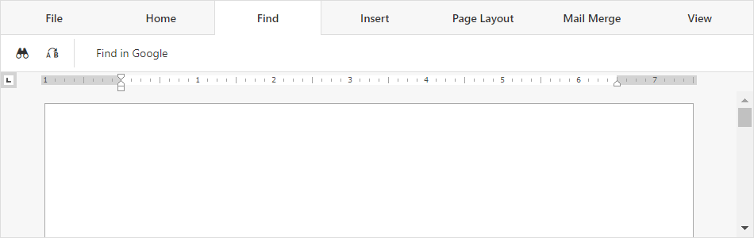

<!-- default badges list -->

[](https://supportcenter.devexpress.com/ticket/details/T848130)
[](https://docs.devexpress.com/GeneralInformation/403183)
<!-- default badges end -->
# Rich Text Editor for ASP.NET Core - How to customize the built-in Ribbon UI in an Angular application

This example is a ready-to-use Angular client application that demonstrates how to customize the DevExpress [Rich Text Editor](https://docs.devexpress.com/AspNetCore/400373/office-inspired-controls/controls/rich-edit)'s Ribbon UI.



The Ribbon is a tabbed toolbar that groups command items on different tabs according to their purpose. Use the Rich Text Editor's [ribbon](https://docs.devexpress.com/AspNetCore/js-DevExpress.RichEdit.Options#js_devexpress_richedit_options_ribbon) option to access and customize the built-in Ribbon UI. The [getTab](https://docs.devexpress.com/AspNetCore/js-DevExpress.RichEdit.Ribbon#js_devexpress_richedit_ribbon_gettab_id_) and [getItem](https://docs.devexpress.com/AspNetCore/js-DevExpress.RichEdit.RibbonTab#js_devexpress_richedit_ribbontab_getitem_id_) methods allow you to access Ribbon tabs and their items. Call the [insertTab](https://docs.devexpress.com/AspNetCore/js-DevExpress.RichEdit.Ribbon#js_devexpress_richedit_ribbon_inserttab_tab_) and [removeTab](https://docs.devexpress.com/AspNetCore/js-DevExpress.RichEdit.Ribbon#js_devexpress_richedit_ribbon_removetab_tab_) methods to modify the collection of tabs. To modify the item collection in a tab, call its [insertItem](https://docs.devexpress.com/AspNetCore/js-DevExpress.RichEdit.RibbonTab#js_devexpress_richedit_ribbontab_insertitem_item_) and [removeItem](https://docs.devexpress.com/AspNetCore/js-DevExpress.RichEdit.RibbonTab#js_devexpress_richedit_ribbontab_removeitem_item_) methods.

## Requirements

* To use the Rich Text Editor control in an Angular application, a [Universal, DXperience, or ASP.NET subscription](https://www.devexpress.com/buy/net/) is required.
* All Devexpress npm packages used in this application should come from the same npm package version.

## Quick Start

Follow the steps below to run this application on your computer:

1. Open the *JS* folder in the command prompt and run the following command to install all npm packages used in the application:

    ```
    npm install
    ```

2. Execute the following command to compile and run the application:

    ```
    ng serve --open
    ```

## Files to Review

- [richedit.component.ts](JS/src/app/richedit/richedit.component.ts)
- [app.component.html](.JS/src/app/app.component.html)
- [angular.json](./JS/angular.json)

## Documentation

- [Add RichEdit to an Angular Application](https://docs.devexpress.com/AspNetCore/401527/office-inspired-controls/controls/rich-edit/angular)
- [Client-Side Ribbon Customization](https://docs.devexpress.com/AspNetCore/401809/rich-edit/client-side-ribbon-customization)

## More Examples

- [Rich Text Editor for ASP.NET Core - Add the control to an Angular application](https://github.com/DevExpress-Examples/asp-net-core-richedit-add-control-to-angular)
